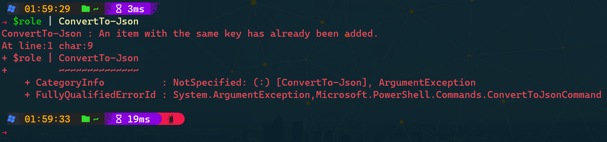

---
date:
  created: 2023-09-06
authors:
 - joshooaj@gmail.com
categories:
  - PowerShell
---

# Debugging ConvertTo-Json



My co-worker, Jared, who regularly uses MilestonePSTools and builds tools with it brought me an interesting problem yesterday - an apparent compatibility issue between our SDK and the `#!powershell ConvertTo-Json` cmdlet from the built-in Microsoft.PowerShell.Utility module. If you've ever struggled with the error "ConvertTo-Json : An item with the same key has already been added.", follow along as I share our debugging process until we finally discovered the root cause. While the details in this post involve the Milestone SDK and the MilestonePSTools module, the root cause and the process of finding it is relevant to anyone using .NET assemblies or 3rd party modules with PowerShell.

<!-- more -->

## The problem

Jared built a fairly comprehensive tool to assist with migrating the configuration from one Milestone site to another. The tool gathers all the camera settings, groups, roles, views, and more, exports it mostly to JSON, and then allows for importing that collection of JSON files into another Milestone site for the purpose of consolidating many small systems into one or more larger systems.

The tool is essentially complete, and Jared was updating to the latest release of MilestonePSTools and MipSdkRedist to verify that everything still worked with the most recent releases, and that's when he discovered it now failed with the error "ConvertTo-Json : An item with the same key has already been added."

## Initial questions

The first thing Jared did was change _nothing_, other than to explicitly import an older version of MilestonePSTools where the problem was known not to exist. This is a great first step to answer the question "is this a problem with the PowerShell module, or the state of the test VMS it is connected to?"

Surprisingly, after importing an older version of MilestonePSTools in a fresh new PowerShell terminal, the problem persisted. This was unexpected.

After running `#!powershell Get-Module` to list the imported modules, he could see that the desired version of MilestonePSTools was imported, but that the latest version of the SDK was being imported instead of the older version of the SDK. This is because MilestonePSTools only requires that MipSdkRedist is _at least_ version x.y.z. By default, PowerShell imported the most recent version available.

The next step was to explicitly import the older version of MipSdkRedist, and then import the older version of MilestonePSTools. At this point, he got the expected result - everything worked correctly.

By this stage, Jared had narrowed the issue down to the latest release of MipSdkRedist since the known-good version of MilestonePSTools failed when using the latest MipSdkRedist release, and succeeded when using the older MipSdkRedist release. The last thing he did before reaching out to me was check to see whether the depth mattered, so he tried a depth of 1 and a depth of 100 and they both failed when using the latest MipSdkRedist module version.

## Is this a bug?

It was at this point that Jared pinged me on Teams to let me know he might have found a bug in the MIP SDK. The MIP SDK is a dependency of MilestonePSTools that is maintained by a team in Denmark that we talk to regularly. But it isn't their responsibility to debug Microsoft's `#!powershell ConvertTo-Json` cmdlet to figure out why it doesn't like some of the objects in our SDK, so we wanted to understand exactly _why_ `#!powershell ConvertTo-Json` was throwing this error.

One of the first things we did was to search for similar reports online. Unfortunately we found several, and the comments weren't any better than the error message itself.

The error "An item with the same key has already been added" is a well-known error to a .NET / C# developer and it happens when you try to add the same key to a dictionary twice. For example...

```powershell
$dictionary = [collections.generic.dictionary[[string], [string]]]::new()
$dictionary.Add('TestKey', 'TestValue')
$dictionary.Add('TestKey', 'TestValue')
```

If you run that, you'll get the error `Exception calling "Add" with "2" argument(s): "An item with the same key has already been added."`.

But how exactly is `#!powershell ConvertTo-Json` finding two properties with the same name on an object? When we use `#!powershell Format-List` and `#!powershell Get-Member` to inspect the properties of the offending object, each property is unique as expected. So is this a bug in the Milestone SDK, or is it a bug in `#!powershell ConvertTo-Json`?

## Select-Object

We were working with a Role object, though later we would discover the issue applies to __all__ configuration api objects. Anyway, on a whim I ran `#!powershell $role | Select-Object * | ConvertTo-Json` and it worked normally. So there was _definitely_ something hinky about the Role type.

## Expanding the error

Every error you see in PowerShell is added to the top of the automatic `#!powershell $Error` variable which is an object of type `#!powershell [System.Collections.ArrayList]` containing a collection of `#!powershell [System.Management.Automation.ErrorRecord]` objects. You will often discover more detailed information by looking closer at these using `#!powershell Format-List * -Force`, and by expanding the Exception and InnerException properties which can sometimes be nested several layers deep.

Here's what I found...

```powershell
$error[0] | Format-List -Force

<#
Exception             : System.ArgumentException: An item with the same key has already been added.
                           at System.ThrowHelper.ThrowArgumentException(ExceptionResource resource)
                           at System.Collections.Generic.Dictionary`2.Insert(TKey key, TValue value, Boolean add)
                           at Microsoft.PowerShell.Commands.ConvertToJsonCommand.ProcessCustomObject[T](Object o, Int32 depth)
                           at Microsoft.PowerShell.Commands.ConvertToJsonCommand.ProcessValue(Object obj, Int32 depth)
                           at Microsoft.PowerShell.Commands.ConvertToJsonCommand.EndProcessing()
                           at System.Management.Automation.CommandProcessorBase.Complete()
TargetObject          :
CategoryInfo          : NotSpecified: (:) [ConvertTo-Json], ArgumentException
FullyQualifiedErrorId : System.ArgumentException,Microsoft.PowerShell.Commands.ConvertToJsonCommand
ErrorDetails          :
InvocationInfo        : System.Management.Automation.InvocationInfo
ScriptStackTrace      : at <ScriptBlock>, <No file>: line 1
PipelineIterationInfo : {}
PSMessageDetails      :
#>


$error[0].Exception | Format-List -Force

<#
Message        : An item with the same key has already been added.
ParamName      :
Data           : {}
InnerException :
TargetSite     : Void ThrowArgumentException(System.ExceptionResource)
StackTrace     :    at System.ThrowHelper.ThrowArgumentException(ExceptionResource resource)
                    at System.Collections.Generic.Dictionary`2.Insert(TKey key, TValue value, Boolean add)
                    at Microsoft.PowerShell.Commands.ConvertToJsonCommand.ProcessCustomObject[T](Object o, Int32 depth)
                    at Microsoft.PowerShell.Commands.ConvertToJsonCommand.ProcessValue(Object obj, Int32 depth)
                    at Microsoft.PowerShell.Commands.ConvertToJsonCommand.EndProcessing()
                    at System.Management.Automation.CommandProcessorBase.Complete()
HelpLink       :
Source         : mscorlib
HResult        : -2147024809
#>
```

Unfortunately I didn't learn much about why the exception was being thrown from digging into the error this time, but the stack trace would be useful in the next step.

## Time to decompile

I was running out of ideas and needed to see the implementation of `#!powershell ConvertTo-Json` to understand how the cmdlet was finding two identical properties on my objects and what they were. By inspecting the error and referencing the stack trace, I knew that the `#!csharp Microsoft.PowerShell.Commands.ConvertToJsonCommand.ProcessCustomObject[T](Object o, Int32 depth)` method is where a duplicate key was being added to a dictionary, so I checked the open-source version of PowerShell (PowerShell 7) on GitHub, but the implementation of [`#!powershell ConvertTo-Json`](https://github.com/PowerShell/PowerShell/blob/master/src/Microsoft.PowerShell.Commands.Utility/commands/utility/WebCmdlet/ConvertToJsonCommand.cs) was too different from the PowerShell 5.1 version to be useful - it didn't have a ProcessCustomObject method.

The source code for PowerShell 5.1 is not publicly available, so I had to resort to using a decompiler tool like [DotPeek](https://www.jetbrains.com/decompiler/) from JetBrains or [JustDecompile](https://www.telerik.com/products/decompiler.aspx) from Telerik. Software and libraries written in C# or any other .NET language are compiled into CIL or "common intermediate language", or IL for short, which is governed by an [open standard](https://www.ecma-international.org/publications-and-standards/standards/ecma-335/). Decompilers can look at a .EXE or .DLL file and interpret the IL, then produce a version of the what the original source code might look like. It's not perfect, and sometimes organizations use tools to obfuscate the compiled assemblies rendering them harder for a human to interpret, but most of the time you can get a good look at the source code and this was no exception.

I won't share any screenshots or snippets of the source code for the `#!powershell ConvertTo-Json` function as I don't want to risk any legal issues related to "reverse engineering" or releasing intellectual property. But here's what I found and how I found it...

## Finding the right DLL

To get a look at the source code, I needed to track down the assembly containing the definition for the `#!powershell ConvertTo-Json` cmdlet. So I started with `Get-Command ConvertTo-Json | Format-List *` which returned the following. The highlighted line showing the path to the DLL is exactly what I needed.

```plaintext hl_lines="2"
HelpUri             : https://go.microsoft.com/fwlink/?LinkID=217032
DLL                 : C:\WINDOWS\Microsoft.Net\assembly\GAC_MSIL\Microsoft.PowerShell.Commands.Utility\v4.0_3.0.0.0__31bf3856ad364e35\Microsoft.PowerShell.Commands.Utility.dll
Verb                : ConvertTo
Noun                : Json
HelpFile            : Microsoft.PowerShell.Commands.Utility.dll-Help.xml
PSSnapIn            :
Version             : 3.1.0.0
ImplementingType    : Microsoft.PowerShell.Commands.ConvertToJsonCommand
Definition          :
                      ConvertTo-Json [-InputObject] <Object> [-Depth <int>] [-Compress] [<CommonParameters>]

DefaultParameterSet :
OutputType          : {}
Options             : ReadOnly
Name                : ConvertTo-Json
CommandType         : Cmdlet
Source              : Microsoft.PowerShell.Utility
Visibility          : Public
ModuleName          : Microsoft.PowerShell.Utility
Module              : Microsoft.PowerShell.Utility
RemotingCapability  : None
Parameters          : {[InputObject, System.Management.Automation.ParameterMetadata], [Depth, System.Management.Automation.ParameterMetadata], [Compress, System.Management.Automation.ParameterMetadata],
                      [Verbose, System.Management.Automation.ParameterMetadata]...}
ParameterSets       : {[-InputObject] <Object> [-Depth <int>] [-Compress] [<CommonParameters>]}
```

## What exactly is ProcessCustomObject doing?

Finally, using my favorite decompiler, I opened the DLL containing the `#!powershell ConvertTo-Json` definition, and found the `ProcessCustomObject` method inside the class `Microsoft.PowerShell.Commands.ConvertToJsonCommand`. Inside the method, I could see that the fields and properties on the objects passed in were being discovered using `#!csharp type.GetProperties(BindingFlags.Instance | BindingFlags.Public)`, so I wrote the same thing in PowerShell and retrieved the names and types of all the properties returned on a Role object. Check out the highlighted lines:

```powershell linenums="1" hl_lines="16 17"
$type = (Get-VmsRole | Select-Object -First 1).GetType()
$properties = $type.GetProperties(([system.reflection.bindingflags]::Instance -bor [system.reflection.bindingflags]::Public))
$properties | Select-Object Name, PropertyType | Sort-Object Name

<#
Name                               PropertyType
----                               ------------
AllowMobileClientLogOn             System.Boolean
AllowSmartClientLogOn              System.Boolean
AllowWebClientLogOn                System.Boolean
ClaimFolder                        VideoOS.Platform.ConfigurationItems.ClaimFolder
ClientProfile                      System.String
Description                        System.String
DisplayName                        System.String
DualAuthorizationRequired          System.Boolean
Id                                 System.Guid
Id                                 System.String
ItemCategory                       System.String
LastModified                       System.DateTime
MakeUsersAnonymousDuringPTZSession System.Boolean
Methods                            System.Collections.ObjectModel.Collection`1[System.String]
Name                               System.String
ParentItemPath                     System.String
ParentPath                         System.String
Path                               System.String
RoleClientLogOnTimeProfile         System.String
RoleDefaultTimeProfile             System.String
RoleType                           System.String
RoleTypeValues                     System.Collections.Generic.Dictionary`2[System.String,System.String]
ServerId                           VideoOS.Platform.ServerId
UserFolder                         VideoOS.Platform.ConfigurationItems.UserFolder
#>
```

So `#!powershell ConvertTo-Json` is using reflection to inspect the objects to be serialized to JSON, and it's finding two different "Id" properties on the Role object - one of type `#!powershell [string]` and one of type `#!powershell [guid]`!

Now that I knew which property was causing the problem, I could take a closer look at those specific properties...

```powershell linenums="1" hl_lines="8 9 23 24"
$type = (Get-VmsRole | Select-Object -First 1).GetType()
$properties = $type.GetProperties(([system.reflection.bindingflags]::Instance -bor [system.reflection.bindingflags]::Public)) | Where-Object Name -eq 'Id'
$properties | Format-List * -Force

<#
MemberType       : Property
Name             : Id
DeclaringType    : VideoOS.Platform.ConfigurationItems.Role
ReflectedType    : VideoOS.Platform.ConfigurationItems.Role
MetadataToken    : 385879854
Module           : VideoOS.Platform.dll
PropertyType     : System.String
Attributes       : None
CanRead          : True
CanWrite         : False
GetMethod        : System.String get_Id()
SetMethod        :
IsSpecialName    : False
CustomAttributes : {[System.Diagnostics.CodeAnalysis.SuppressMessageAttribute("Microsoft.Naming", "CA1704:IdentifiersShouldBeSpelledCorrectly")]}

MemberType       : Property
Name             : Id
DeclaringType    : VideoOS.Platform.ConfigurationItems.IConfigurationItem
ReflectedType    : VideoOS.Platform.ConfigurationItems.Role
MetadataToken    : 385879365
Module           : VideoOS.Platform.dll
PropertyType     : System.Guid
Attributes       : None
CanRead          : True
CanWrite         : False
GetMethod        : System.Guid get_Id()
SetMethod        :
IsSpecialName    : False
CustomAttributes : {}
#>
```

Looking at the `DeclaringType` property, I could see that the Id property of type `#!powershell [string]` that I'm used to is declared on the Role type directly. However, the new `#!powershell [guid]` Id property is defined on the IConfigurationItem type inherited from by the Role type. And indeed, looking at the source code for the SDK, that Id property was recently added for one reason or another and I'm now checking with the SDK team to understand why, and whether it is possible to safely change the implementation since it is a relatively new and apparently breaking change in rare circumstances.

## What next?

In our case, we can work around this duplicate Id property if needed by using `#!powershell Select-Object` to filter for the properties we want, or even use `#!powershell Select-Object *` which generates a new type on the fly with all the visible properties of the incoming object.

I _think_ the "right way" to resolve the issue is to make it so that the Id properties on both the IConfigurationItem and the various types that inherit from it are both of type `#!powershell [string]` and then override the Id property on child types rather than declare _another_ Id property which effectively "hides" the parent types version of the property except when using reflection.

Reflection is the primary language tool in .NET for building serializers for converting objects to and from JSON, XML, and other formats, and using the override key word should hopefully make it so that the only Id property available to `ConvertTo-Json` and other serializers is the one on the objects where the property is overridden.

--8<-- "abbreviations.md"
