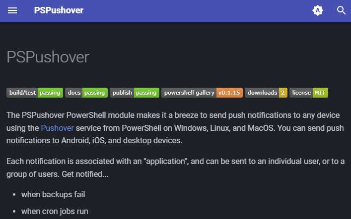
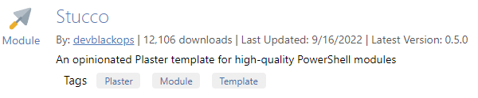
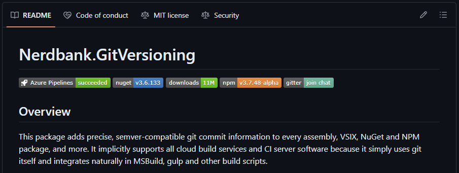
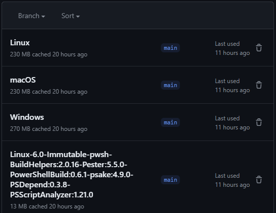

# New PSPushover PowerShell Module

Back in 2021 I wrote a module called [Poshover](https://github.com/joshooaj/Poshover)
for sending push notifications with [Pushover.net](https://pushover.net). This
week I decided to use that module as a reference during my PowerShell + DevOps Summit
workshop in a few weeks. I never liked the name, so I renamed it to [PSPushover](https://www.joshooaj.com/PSPushover/)
and set it up in a new repository.

<!-- more -->

The module itself is pretty fun - there's a lot of reasons you might want to use
push notifications, especially if you maintain a home lab like I do. I use them
to see when backup operations begin and end (_or fail_ 😱), when my container
host restarts, and when CrowdSec detects and blocks an external IP for suspicious
or malicious activity.

I think I enjoyed the process of setting up the repository more than the
the module itself. I plan to use it as an example of how you might automate the
process of generating and updating documentation for your PowerShell modules,
as well as how you can use MkDocs to generate a static website from your docs,
and finally how you can automatically generate and host those docs with GitHub
Pages. In this post though, I want to share some of the features of the repo
and the tools used along the way. Check out the related links in the side bar
to a bunch of the modules/utilities mentioned below.

## Scaffolding

The scaffolding for the repo was done using Brandon Olin's [Stucco](https://github.com/devblackops/Stucco)
module which has been my favorite way to start a new PowerShell module project
for a while. It's not updated frequently and there are some issues I've run into
in the past with some of the dependencies including RamblingCookieMonster's [BuildHelpers](https://github.com/RamblingCookieMonster/BuildHelpers)
and Brandon's [PowerShellBuild](https://github.com/psake/PowerShellBuild) module,
but it gets me up and running fast and I'm pleased as punch with 90+% of Brandon's
"opinionated Plaster template for building high-quality PowerShell modules".

## DevContainer / Codespace

The Stucco plater template includes a starter devcontainer, but since I want to
use the devcontainer as a tool to build and serve an MkDocs site for local
documentation previews, I changed the Dockerfile to use `squidfunk/mkdocs-material:latest`
as a base image, and updated the file to install PowerShell 7 and setup a non-root
user. And because I typically use a Windows laptop at home, I made some tweaks to
`devcontainer.json` to handle some filesystem permission issues as well as to
"bootstrap" the devcontainer on startup so that all the PowerShell and python
dependencies are available.

## Automated versioning with Nerdbank.GitVersioning

There are lots of ways to handle versioning. I've never looked into a strategy for
automating the major/minor version numbers - that doesn't seem smart or easy to
do while maintaining SemVer versioning. But I've done "patch" version updates in
a few different ways in the past:

- Manually bumping the version before (or immediately after) releasing.
  - I don't like having to do a git commit to bump the version after every single release.
- Using a version based on the time elapsed since the unix epoch.
  - This isn't _bad_ but if you use days-since-epoch you can't easily release twice in a day if you need to. And the patch number can get pretty long.
- Checking the latest version on PSGallery and incrementing it by one.
  - This is a great option. It puts a dependency on being able to reach PSGallery, but it has pretty good uptime and if you're publishing to the gallery anyway, your publish step will fail during an outage anyway.

My favorite method now is to use the [Nerdbank.GitVersioning](https://github.com/dotnet/Nerdbank.GitVersioning)
CLI tool, `nbgv`, with a `version.json` file at the root of the project to describe
the version schema. The advantage here over the previous strategies I've used is
that the module version can be easily connected to the associated git commit.

Here's how it works with the PSPushover module right now:

1. The `version.json` file provides the major/minor version numbers and whatever the number is the module manifest is irrelevant as it will be updated in the build output as a part of the build.
2. In `psakeFile.ps1`, I manually set the module version to use for the "compiled" module by running `nbgv get-version` and grabbing the `SimpleVersion` value.
3. When it's time to bump the major or minor version, I'll update the `version.json` file. Until then, the versioning takes care of itself.

## Automated publishing on v* tags

When a tag like "v0.1.x" is created on the main branch, a workflow runs like it
does on any other commit or pull request. If the workflow succeeds in building
and testing the module on Linux, macOS and Windows, a separate `Publish.yml`
workflow runs a publish job if, and only if the previous workflow succeeded, and
if `github.event.workflow_run.head_branch` starts with "v".

## Caching

While the building and publishing workflows run relatively quickly on this small
module, I added some caching using `actions/cache` and [Chrissy LeMaire's](https://github.com/potatoqualitee)
`potatoqualitee/psmodulecache` GitHub Action. All in all, the caches I setup are
helping with the python pip cache, the PowerShell module dependencies, and the
`squidfunk/mkdocs-material` docker image which is used for building and pushing
the docs site to GitHub Pages.

The `psmodulecache` GitHub Action is pretty great, but one thing it didn't allow
me to do (yet) was reference my existing PSDepend `requirements.psd1` file, and
I didn't want to declare my PowerShell module dependencies in multiple places.
So my workaround was to run a step just before `psmodulecache` which reads the
existing `requirements.psd1` file, grabs the PowerShell module names and versions,
and formats them the way `psmodulecache` expects them, then writes them to
`GITHUB_OUTPUT`. Then in my `modules-to-cache` input for `psmodulecache` I reference
the output from the previous step instead of hard-coding dependency names/versions
in my workflow files.

There was one last "gotcha" I ran into with caching PowerShell modules in my GitHub
Actions and that was the "key" used to identify the cache. The key Chrissy uses
is based on the OS, the shell, and then a concatenated list of the dependencies
declared in `modules-to-cache`. Instead of each consecutive build re-using the existing
caches, they were generating new caches each time because the module names were
in different orders each time. When I realized it's because of the fact that the
`[hashtable]` object uses unordered keys, I updated the workflows to _sort_ the
modules before joining them into a comma-separated list and writing them to
`GITHUB_OUTPUT`.

## Automated documentation

Okay it's not _completely_ automated. While I could plug OpenAI into the pipeline
to generate some help text for PowerShell commands to use in place of the stubs
created by PlatyPS, I haven't done it yet. However, there's a Docs build step
in the `PowerShellBuild` module which is using PlatyPS to create and/or update
markdown files for all public cmdlets in the module. All I had to do was fill
in the placeholder values for synopsis, descriptions, and examples.

I updated the `mkdocs.yml` file to use the [Material for MkDocs](https://squidfunk.github.io/mkdocs-material/)
theme, made a home page, and added "online version" values to the frontmatter
for each cmdlet so that you can run `Get-Help Send-Pushover -Online` in PowerShell
to launch a browser to the associated online help.

There's a dedicated `Docs.yml` workflow that runs whenever there's a push to the
main branch with a change to anything under `docs/`, to `mkdocs.yml`, or to the
`Docs.yml` workflow itself. Then there's also a `workflow_dispatch` trigger so that
I can update the docs manually if at any time I need to. Limiting the scope of
files that can trigger an automatic workflow run helps prevent unnecessary jobs
from burning up time on GitHub's runners.

## Pushover notification demo

Finally, I had the idea to allow people to subscribe to Pushover notifications
sent when someone "stars" the GitHub repo as a way to see what the notifications
look like without creating their own "application" in their Pushover dashboard
and running the `Send-Pushover` cmdlet themselves.

The `NotifyOnStarred.yml` workflow is triggered on GitHub's `watch` event - that's
the name of the event that fires when someone stars a repo. Then the version of
PSPushover currently on the main branch is imported, and app/user tokens are read
from GitHub Action secrets, and a notification is sent to a dynamic Pushover
distribution group.

If you [subscribe to PSPushover notifications](https://pushover.net/subscribe/PSPushover-2hw5raj6uqr5dsw)
you can securely join the distribution group without exposing your real Pushover
user token, or even having to know what a token is. You can then star the repo,
and in ~15 seconds you'll get a cute little push notification (and so will I!).
Then of course you can unsubscribe because who wants extraneous notifications, right?

--8<-- "abbreviations.md"
