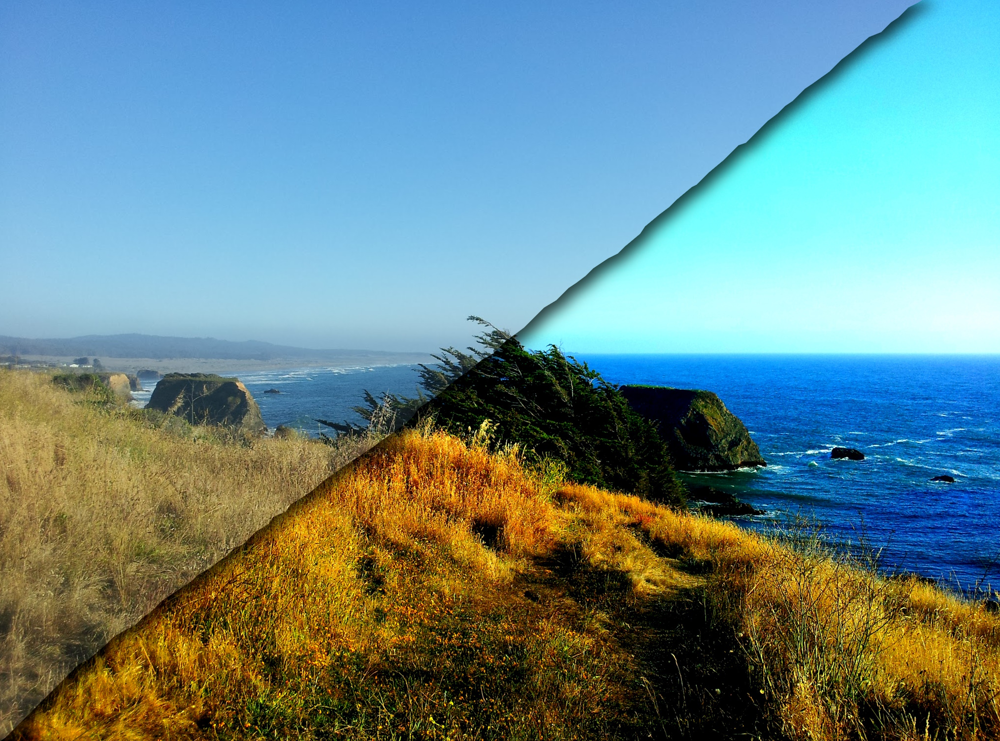
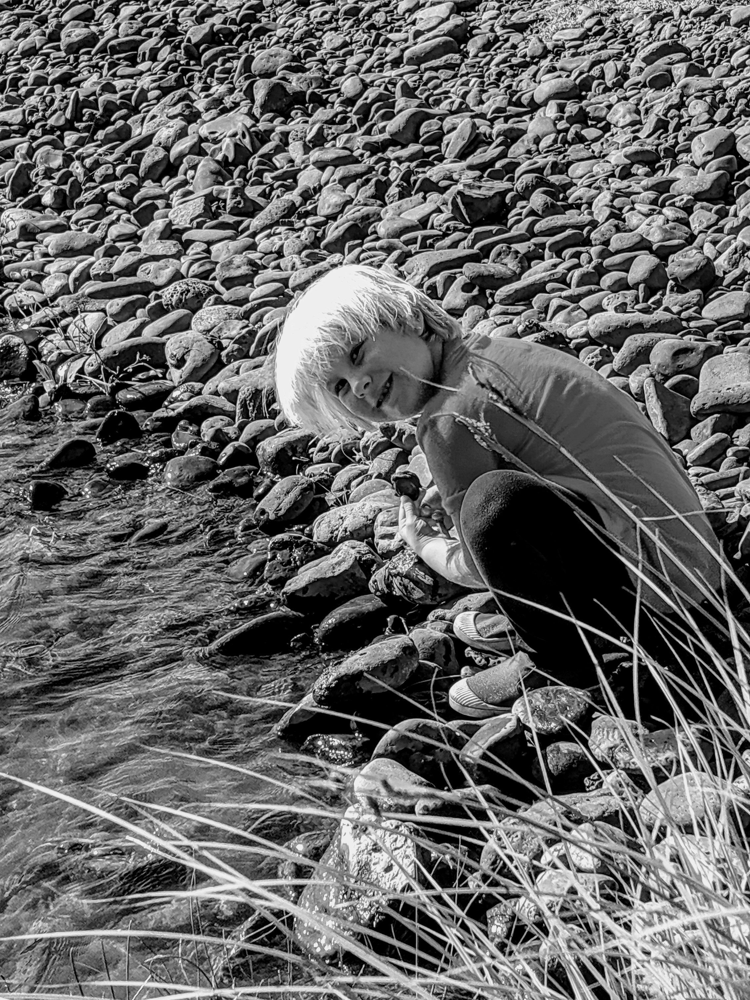
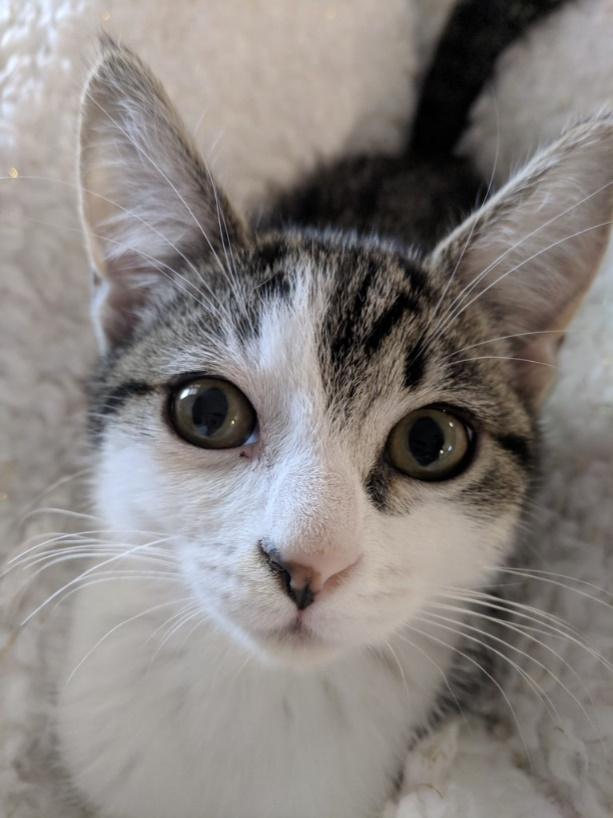

---
date:
  created: 2024-03-24
authors:
 - joshooaj@gmail.com
categories:
  - PowerShell
  - Computer Vision
links:
  - Blog post - Kind Of Like That: https://www.hackerfactor.com/blog/index.php?/archives/529-Kind-of-Like-That.html
  - Wikipedia - Hamming Distance: https://en.wikipedia.org/wiki/Hamming_distance
  - Wikipedia - Perceptual Hashing: https://en.wikipedia.org/wiki/Perceptual_hashing
---

# Image Comparison



A couple weeks ago I came across a couple of blog post on image comparison
algorithms shared by Dr. Neal Krawetz. One of them, titled "[Kind Of Like That](https://www.hackerfactor.com/blog/index.php?/archives/529-Kind-of-Like-That.html)",
describes the "dHash" algorithm which generates a perceptual hash based on
gradients in the image. With more than 200k family photos to wrangle, I wrote up
a PowerShell implementation to find similar images and it works surprisingly well!

<!-- more -->

After almost 20 years of taking pictures and videos with our smart phones, our
family photos and videos are scattered between the Google and Apple clouds. In
order to make sure all these memories are safe, no matter what happens with our
cloud accounts over time, I downloaded _everything_, and will be following a
3-2-1 backup strategy. That means there will be at least three copies, on two
different storage mediums, with one copy offsite.

## So many duplicates

While trying out a self-hosted instance of [PhotoPrism](https://www.photoprism.app/)
and indexing over 60k files so far, I noticed that _a lot_ of our photos are
duplicates. Many of them are exact duplicates and those are easy to find using
a traditional SHA hash, but most duplicates are...

- resized versions of the original
- edited to add a border or to change the colors in some way
- very similar images taken within the same second or two, and not duplicates at all

I'm sure I have enough storage available to just back them all up, but the percentage
of wasted space is somewhere around 40% and it just didn't sit well with me. Plus,
with so many duplicates, it's frustrating to scroll through the library in apps
like PhotoPrism. Tagging faces gets old quickly when you keep seeing the same face
in the same photo repeated over and over.

## The algorithm

I searched around online to see what my options were in terms of tools, or maybe
existing .NET or Python libraries, and that's when I came across one of Dr. Neal
Krawetz' blog posts. It's a short and interesting read, and my first introduction
to a "perceptual hash". If you're interested, please do go check out his blog!

I hear and use the word "hash" on a regular basis, and have used all kinds of
cryptographic hashes over the years including md5, bcrypt, and the various sha's.
But these are fundamentally different algorithms with almost polar opposite
goals. The kind of hashs I was familar with were designed to produce _wildly_
different results from two sets of data if even a __single bit__ was different
between them. The resulting hashes were either the same, indicating that the
inputs were _very likely_ the same (collisions happen, but they're hard to find),
or they were different, indicating that the inputs were _definitely_ different.
There should be no way to measure how similar two inputs are based on their SHA
hashes. If you could, the algorithm would be too weak to use for any kind of
security or privacy on the web.

In contrast, a perceptual hash like dHash will, by design, produce the same or
similar hash when given two images that are nearly identical. And since each bit
in the 64bit hash represents a part of the image, you can calculate the
[hamming distance](https://en.wikipedia.org/wiki/Hamming_distance) between two
hashes to determine how many of the 64bits in the two hashes are different.
Fewer differences indicate a higher likelihood that the hashes are from the same
or similar images.

Here's a quick summary of the dHash algorithm:

1. Reduce the size to 9x8 pixels. Don't worry about the original image size or aspect ratio.
2. Convert to grayscale because we only care about the "brightness" of each pixel.
3. Compare each pixel's brightness to the neighbor on the right. This is why the image is resized to 9x8 - we need 8 bits per row.
4. Assign a bit value of "1" if the current pixel is brighter than the neighbor on the right.

You will end up with one byte per row, and 8 rows, for a total of 64 bits. Convert
the array of bytes to a hexadecimal string and you have your dHash.

## Examples

### Nearly identical

These photos of my daughter at the river are nearly identical to the untrained
eye, but the raw files are very different. In the following table you'll find a
side-by-side comparison of what appears to be the same image, and their dHashes
along with a SHA1. For fun, you'll also find the 9x8 grayscale versions from which the
dHashes were derived.

The hamming distance between the dHash values from these images is 2, which means
two out of the 64 bits of the hash were different, so as you would expect, the
hash comparison shows that the images have a strong visual similarity.

| Photo 1                                        | Photo 2                                        |
| ---------------------------------------------- | ---------------------------------------------- |
| { width="300" }          | { width="300" }          |
| { width="300" }    | { width="300" }    |
| dHash: 41**30**4c**4b**e436784c                | dHash: 41**20**4c**49**e436784c                |
| SHA1: 80187EB0E86F2FCDE82E60D7CD53BB0B1B1FF686 | SHA1: 5BC13493BB94536C3EAE794A924C1D9A00D207D6 |

### Image filter applied

In this next example, the first image is the original and the second has been
"color enhanced". We can see that the images are _definitely different_, but we
can also see that they're most likely the same image with different colors. Once
again, when we compare the dHashes, we get a difference of 2. Since that is well
under 10, we can be fairly confident that the images are similar.

| Photo 3                                        | Photo 4                                        |
| ---------------------------------------------- | ---------------------------------------------- |
| { width="300" }          | { width="300" }          |
| { width="300" }    | { width="300" }    |
| dHash: 60606040**58**7c**5c**7c                | dHash: 60606040**d8**7c**5d**7c                |
| SHA1: BDE8B4AB0DC4E28D4DA72A982E4B99159E72EA9C | SHA1: C624DC07813ABBC07E286665AF7A41941F19F9AF |

### Very different cats

Okay in this last example, just to demonstrate that the algorithm doesn't consider
all images similar, here are two very different cats because... internet. The
dHash comparison returns a value of 20.

| Photo 5                                        | Photo 6                                        |
| ---------------------------------------------- | ---------------------------------------------- |
| { width="300" }          | { width="300" }          |
| { width="300" }    | { width="300" }    |
| dHash: **564e7c6cee3f526e**                    | dHash: **564e7c6cee3f526e**                    |
| SHA1: 51E2DFE65974C86740C314E7883D22C163D3EA1B | SHA1: A58DBDAA875B5FC311BBB35A74748E68550CFC12 |

## Code

Here's the code so far. The idea was that the cmdlets should work similar to the
way the `Get-FileHash` cmdlet works, so the output of `Get-PerceptHash` is a
`[PSCustomObject]` with an Algorithm, Hash, and Path property. When I get around
to it, I think I'll implement additional perception hashes incuding aHash and pHash
as described by Dr. Neal Krawetz, but for now only the dHash algorithm is implemented
here.

Later, I'll post an update with another potential use-case for this - comparison of video
surveillance images for the purpose of checking whether a camera has been obscured
or moved. I'm not sure the reliability is good enough to use on it's own, but I'm
thinking it should be relatively easy to do multiple types of perception hashes
and edge detection to produce a sort of composite hash for better accuracy.

[Download :material-download:](PerceptHash.psm1){ .md-button .md-button--primary }

```powershell title="PerceptHash.psm1" linenums="1"
--8<-- "blog/posts/2024-03-23-Image-Comparison/PerceptHash.psm1"
```

--8<-- "abbreviations.md"
