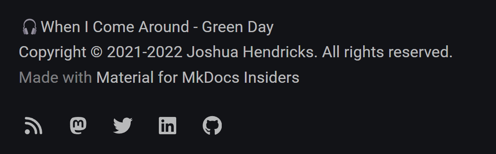
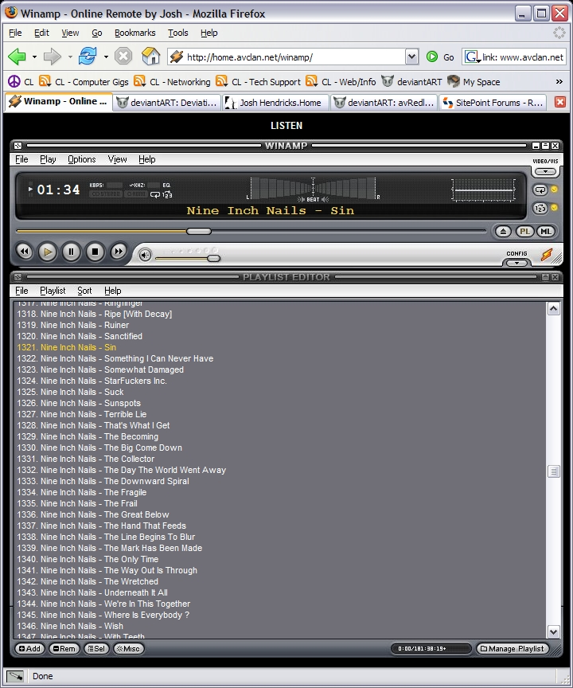
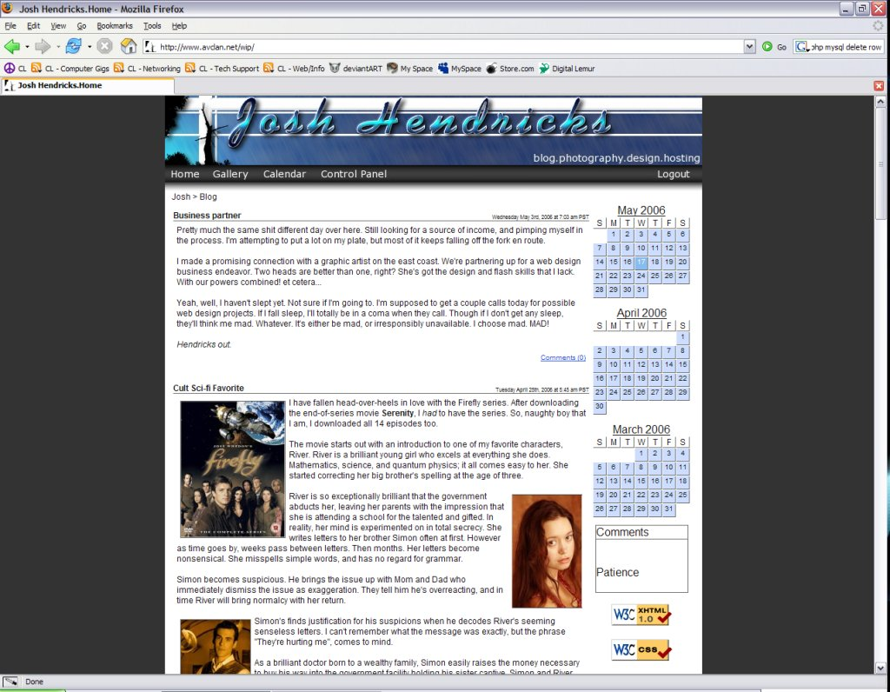

---
date:
  created: 2024-05-12
authors:
 - joshooaj@gmail.com
categories:
  - PowerShell
  - Homelab
  - MkDocs
---

# Serving a web api with Pode



I added a subtle "Now playing" text to the footer of this site which represents the first result in the response from
the [user.getRecentTracks](https://www.last.fm/api/show/user.getRecentTracks) method on the Last.FM API. The data is
updated every few seconds with a little bit of JavaScript by polling a small Pode web service running in my home lab.

<!-- more -->


Could I have polled Last.FM's API directly from this website? Absolutely. But then I would have no control over how
frequently my API key is used to poll the Last.FM API which means there's a risk (as low as it is) of being
rate-limited, and even more problematic is that I would have to expose my API key to the client. Remember - never trust
anyone or anything connecting to your web service to keep a secret - especially a secret that doesn't expire. If you
wouldn't send the information to an internet-stranger, don't embed it into a webpage.

To avoid exposing any credentials, minimize the API surface area exposed to the client, and ultimately just for the fun
of it, I created a small Docker image hosting a tiny [Pode app](https://github.com/Badgerati/Pode). Are there more
efficient tools for serving a simple web API? Probably. Do they let me do it in PowerShell? Probably not.

## A little context

I was 21 years old in 2006 which is roughly the last time I tried to do anything interesting with JavaScript. The above
image is a screenshot of Winamp - one of the most popular media players of the time (it really whips the
llama's ass!), except it looks like it's running in the browser.



There was no browser-based Winamp at the time though as far as I'm aware. I had painstakingly sliced screenshots of the
Winamp interface and stitched them together in HTML. I then populated that interface with live data from a Winamp plugin
which I _think_ was called "Snow Crash" (yep, like the novel). The buttons, playlist, and scrollbars were all wired up
so you could control the Winamp instance running on my computer, and while I don't have a screenshot of it, I also added
a simple "Now playing" control to my hand-made blog I was using at the time.



Lately I've been using [Navidrome](https://github.com/navidrome/navidrome) to serve my music from a container in my home
lab as it has a nice web interface, and it's compatible with the [Subsonic](https://www.subsonic.org/pages/index.jsp)
API which makes it possible to use with a variety of Android/iOS apps with support for caching and downloading tracks.

I remembered that old Winamp remote and thought it would be a fun exercise or code kata to get a live "Now playing..."
message on my blog again.

## Dockerfile

Initially my dockerfile included an embedded copy of my Pode app files, `packages.json` and `server.ps1`, but I quickly
realized it would be better for the container image to simply include the Pode module, and a default entrypoint so that
you can supply your Pode app at runtime rather than at buildtime. So an already relatively simple dockerfile became even
more simple.

```yaml title="File: Dockerfile" linenums="1"
--8<-- "blog/posts/2024-05-03-Pode-Now-Playing/src/dockerfile"
```

## Docker Compose

I already run several applications at home, and most of them run in containers behind Traefik, so it seemed natural to
run this the same way. Traefik routes all the inbound HTTP/S connections it receives from my network firewall to the
appropriate service primarily based on labels on those services in the `compose.yml` Docker Compose files.

In this case, I'm using the following compose file to describe the service, including when Traefik should route
requests to it. The Last.FM environment variables are supplied from an external `.env` file so that the `compose.yml`
file can be safely shared or commited to git.

```yaml title="File: compose.yml" linenums="1"
--8<-- "blog/posts/2024-05-03-Pode-Now-Playing/src/compose.yml"
```

By running `docker compose build` in the same folder as the `compose.yml` and the `dockerfile` referenced by the compose
file, the container image is built and tagged according to the compose file. Now I just need to supply the files for the
Pode app, and "up" the service with `docker compose up -d`.

## Pode app

To start, I ran the `pode init` command to generate a `package.json` file. I was prompted for a few bits of information before a simple `packages.json` file was stubbed out for me.

```plaintext title="pode init"
PS> pode init

name (temp): homelab
version (1.0.0):
description: API endpoint for exposed homelab information
entry point (./server.ps1):
author: joshooaj
license (MIT):
Success, saved package.json
```

```json title="File: app/package.json" linenums="1"
--8<-- "blog/posts/2024-05-03-Pode-Now-Playing/src/package.json"
```

Then I created a `server.ps1` file since that was the default file name referenced as the entrypoint in the
`package.json` file produced in the previous step. Here is the `server.ps1` file responsible for providing a list of
[recent tracks](https://homelab.joshooaj.com/music/recenttracks).

```powershell title="File: app/server.ps1" linenums="1"
--8<-- "blog/posts/2024-05-03-Pode-Now-Playing/src/server.ps1"
```

1. Pode will run in a container behind a reverse proxy (Traefik) which will expose this as an HTTPS service so HTTP is
   fine here.
2. Only call Last.FM API if there is no previous cached response or the last response is older than 1 minute.
3. The API always returns 50 tracks but if the "limit" query param is provided, only return that many.
4. Build response with cached value of "recenttracks" and filter response to the first $limit records.

--8<-- "abbreviations.md"
