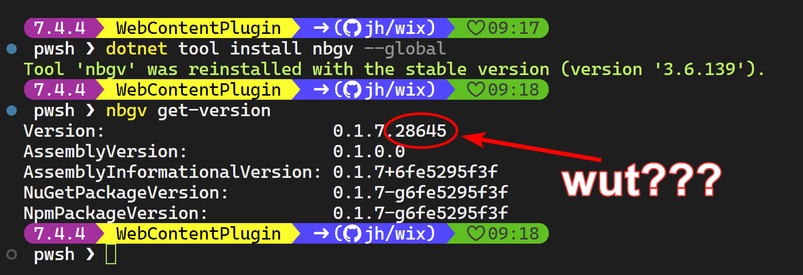
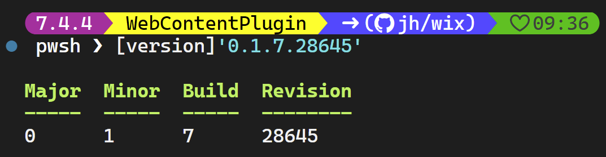

---
date:
  created: 2024-08-02
authors:
 - joshooaj@gmail.com
categories:
  - .NET
  - GitVersioning
---

# Nerdbank.GitVersioning and the Revision number



I love using the NerdBank.GitVersioning CLI tool `nbgv`. It completely removes the need to think about an aspect of a
project that doesn't add any value to your customers. But today I realized I understood the first three parts of the
version produced by `nbgv`, but the fourth "revision" component was not obvious. Turns out it is a uint16 value of the
first two bytes of the commit id!

<!-- more -->

When I version a PowerShell module or any other project, I typically only care about the main three parts - MAJOR.MINOR.PATCH.
These are the first three parts of a SemVer or [Semantic Versioning](https://semver.org/) compliant version number.
However, you'll often see four components to a version number. The .NET `System.Version` class displays the version
number `0.1.7.28645` using the Major.Minor.Build.Revision component names.



The fourth component of this version, the "Revision", is often ignored. For example, the Windows Installer framework
doesn't consider this number at all when comparing two versions of the same application, so it would consider version
1.1.1.1 to be exactly the same as version 1.1.1.2.

If I'm following the principles of semantic versioning, then I almost never care about that fourth version component.
But today I was curious where on earth `nbgv` was coming up with "28645" for the revision number. I looked at the docs
and couldn't find it. I asked Copilot, and returned a hallucination.

To figure it out, I first confirmed that the number only changes after a commit. Then I looked at the Revision before,
and after a commit, and the numbers looked relatively close together. My first thought was that it could be time-based.
Maybe the time elapsed between commits? The numbers were relatively close to the number of seconds elapsed in the day,
but that definitely wasn't it.

So then I figured it had to be based on the commit hash considering the `AssemblyInformationalVersion` value represented
the version as `0.1.7+6fe5295f3f` with `6fe5295f3f` representing the short commit hash. Since a commit hash is a
hexadecimal representation of a byte array, I thought maybe the Revision was determined by the hash. But the value of
the revision number was too low to be based on the whole hash.

Since the number "28645" was 5 digits, I guessed it could be an `int16` or `uint16`. And because you can't have a
negative version number component, I figured it must be an unsigned value, so a `uint16` with a max value of 65535. You
can see the max value yourself from PowerShell by running `[uint16]::MaxValue`.

I then ran the following code in Powershell...

```powershell
# Create a byte array based on the bytes represented by 6f and e5
# which are the leading two bytes in the commit hash.
$bytes = [convert]::ToByte('6f', 16), [convert]::ToByte('e5', 16 )

# Convert those two bytes to an unsigned 16-bit integer
[bitconverter]::ToUInt16($bytes, 0)

<# OUTPUT
  58735
#>
```

But that returned "58735" which didn't match the "28645" I was expecting, so I reversed the bytes and tried again...

```powershell
# Create a byte array based on the bytes represented by 6f and e5
# which are the leading two bytes in the commit hash.
$bytes = [convert]::ToByte('e5', 16), [convert]::ToByte('6f', 16 )

# Convert those two bytes to an unsigned 16-bit integer
[bitconverter]::ToUInt16($bytes, 0)

<# OUTPUT
  28645
#>
```

And there it was! This was of absolutely no value to me today beyond solving a mystery that was suddenly, and
inexplicably important beyond reason. I hope you enjoy this little nugget as much as I did.

--8<-- "abbreviations.md"
