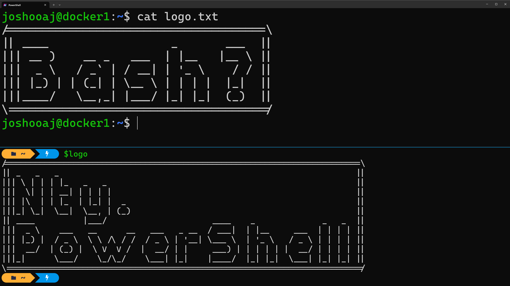
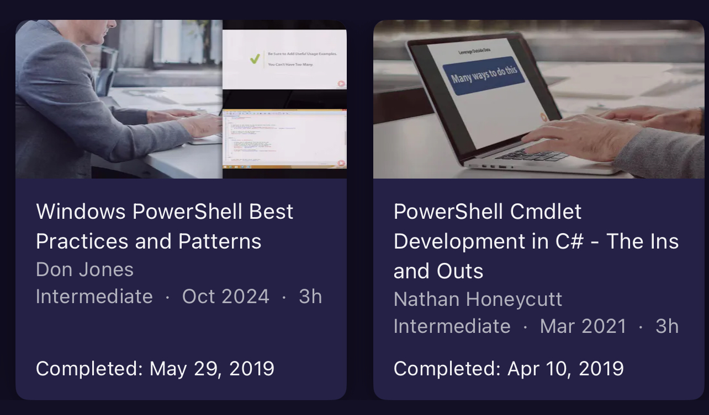

# Why I never learned Bash

I’ve been using a computer since ~1996 (age 12/13). I’ve built many PCs, and installed various Windows and Linux operating systems many hundreds of times over the past 28 years. I played L.O.R.D. on my dads BBS, played DOS games like Wolfenstein 3D, Descent, and Duke Nukem. So far in my IT career I’ve worked as a system administrator, software vendor support, and as software developer. It may surprise you to hear then that I learned my first shell language just 5 years ago, in 2019.

<!-- more -->

Having been indoctrinated as a Windows user at a young age by my dad, who was learning to use a computer at the same time, I did occasionally find myself at the command prompt. But it wasn’t a place of comfort. Even the limited capabilities of `cmd` were beyond me. I could run individual commands like `ipconfig`, `ping`, and `tracert`, and if pressed, I could write a basic `.bat` file. But I never did take the time to learn the different commands and syntax for assigning and evaluating variables or implementing control flow.

Surely I learned bash though, right? I mean I did rent and operate a Counter-Strike game server, built and maintained a LAMP-stack website on Dreamhost, and tinkered with Linux from time to time at home. Unfortunately having started with Windows, I didn’t have an appreciation for the terminal and the things you could do in bash. So no, to this day I’m still only slightly more familiar with bash than I was with cmd.

## No PowerShell in physical security

The work that I was doing between 2006 and 2019 would certainly have benefited from fluency at the terminal. Only, I was already comfortable enough in other languages like Python and C# that I didn’t feel any pressure to learn to write even basic BAT or PowerShell scripts. Whenever I needed to do something for which I had no dedicated CLI or GUI tool, I would write one in a language I already knew! Not to mention basically _nobody_ in the physical security industry was using PowerShell. It just didn't exist in my world yet.

In fact, with how much I enjoy using PowerShell today, you’d be surprised how much I _despised_ that “blue command prompt”. I avoided using it out of fear. Maybe even hatred? I couldn’t articulate _why_ I felt the way I did about it. It was an emotional response mostly, but I do vaguely recall some technical reasons for my feelings at the time.

I remember once in a while I would accidentally find myself in that damn blue command prompt, and I’d think I was using a native command like `rm`, `del`, or `sc`, and then I’d get an unexpected error because these commands are all PowerShell aliases. Not that I knew what those were at the time. When the blue command prompt failed me, it was always the fault of the blue window and I’d just fall back to good ol’ B&W `cmd`.

## Why I learned PowerShell

So what changed in 2019 that finally warmed me up to PowerShell? I was 34, and had spent a whole 13 years of my career blissfully ignorant of what PowerShell even was. I would even call it a successful career so far. I earned a great salary and was already considered very good at what I did by my peers. I could probably have gone the rest of my career without learning PowerShell and I think I would have still done well for myself. Nobody in my sphere was using it, let alone recommending that _I_ use it.

Well, in early 2019 I was pulled in as a technical consultant for an opportunity with a very large global customer (think FAANG). This customer was piloting our software alongside two of our competitors, and given the nature of the company and the scale at which they would be rolling out the winning vendor’s software, they had very specific questions and requirements from an API perspective. I was one of very few people in our Americas team with knowledge of our SDK, and I think it was anticipated that I would answer some technical questions and that would be the end of my involvement.

In our first meeting I learned of two specific requirements we had to meet to even proceed with the pilot:

1. A REST API was required for some specific configuration and reporting purposes.
2. It must be possible to install and configure the software, and add surveillance cameras from PowerShell.

You may not know this about me, but I am _highly motivated_ by a challenge. We didn’t yet have a native REST API as all our APIs were primarily WCF or SOAP-based. But we did have a .NET SDK so to meet this requirement I built a prototype REST API “bridge” using our SDK in an ASP.NET project. I was able to demonstrate the possibility of building their own REST API in that manner, and that satisfied their first requirement along with our promise to release a first-party REST API in the future (we did).

With that first requirement met, I faced my nemesis and began looking at PowerShell more closely. I didn’t quite know where to start, but we did have one or two basic PowerShell samples in our SDK documentation so I pointed the customer to those first.

Soon I would get a question like “that’s cool, but how do I do X?” and I would dig into the our .NET SDK documentation and fumble around and tweak the existing samples to do X. Then they’d ask about Y, and I’d do it over again.

Each time I’d answer a question, I’d add to a growing collection of disjointed procedural PowerShell scripts that I barely understood. Each one was repetitive with copy & pasted login procedures and other boilerplate, and they were a pain to send to the customer. But as we went back and forth, I was slowly acclimating to the bizarre and verbose PowerShell syntax. Eventually, and simultaneously, three thoughts struck me:

1. A PowerShell session is just an interactive .NET application with a REPL (Read, Evaluate, Print, Loop).
2. This customer needed a PowerShell _module_ for interacting with our software, not PowerShell scripts.
3. Our SDK can be used in a PowerShell module written in C# (my comfort zone).

So a few weeks into my PowerShell journey, before ever writing a PowerShell function, and having only the slightest clue what I was doing, I jumped into the deep end. I started watching Nathan Honeycutt’s Pluralsight course, “PowerShell Cmdlet Development in C# - The Ins and Outs”, and went to work building my first PowerShell module in C#.

## It grew on me

The more commands I baked into this new module, the simpler the scripts became for the customer. Instead of writing esoteric and arcane .NET code in PowerShell to interact with our SDK, the customer could use our SDK indirectly by using simple PowerShell commands with easily understood names following the verb-noun syntax PowerShell is so famous for.

This was a turning point for me and my career. I experienced a seismic shift in the way I thought about software, IT, and administration. I began mentally prioritizing scalability, repeatability, and ease of use by the average IT person rather than the average .NET developer. It started becoming so much easier to build new tools using our SDK from PowerShell instead of C#. I could write a “program” in minutes as a PowerShell script that would have taken me _hours_ as a CLI written in C#. And our customers could do that too!

By the summer of 2019 we got the word that we’d won the opportunity, but I didn’t stop working on the module. I kept on developing this new [MilestonePSTools](https://www.milestonepstools.com) module. I took it upon myself to publish it to the PowerShell gallery to make it easier to make updates available to customers.

At some point later that year I discovered PowerShell’s help system, platyps, and mkdocs thanks to Brandon Olin’s partially-completed book [Building PowerShell Modules](https://leanpub.com/building-powershell-modules) on LeanPub. Inspired by that, I bought a domain, dipped my toes into GitHub pipelines, and hosted the module documentation online.

Over time, I introduced more and more customers to it, and it eventually became a major tool in our own professional services teams. It has been a key factor in landing (and/or retaining) several of our larger customers in the last 5 years.

## Bash is hostile

I still use bash once in a while. Usually when I’m writing a dockerfile. The work I do doesn’t require me to “live off the land” and maintain hundreds or thousands of Linux machines so I haven’t bothered to become proficient in it. While I do respect it as a capable incumbent, and I recognize the world basically runs on Linux and bash scripts, I find bash an unfriendly environment compared to PowerShell. Hostile even.

That's it. Bash is hostile. That's why I don't use it if I don't have to. That's why I think PowerShell is so much better _for me_ and the kind of work I do. Here are a few reasons why bash pushes me away, and PowerShell feels like home.

### Bash is undiscoverable

Bash relies on existing native binaries with terse, impossible to discover names and cryptic arguments. Unless you've heard of a command before or came across it on stack overflow, good freakin luck finding the command you need without scouring the internet.

What's that? You want to parse some JSON data you got from a web api? The command you're looking for is `jq`. Duh.

In PowerShell, you're looking for `ConvertFrom-Json`. Oh, you didn't know that? That's okay - you can discover what commands work with JSON by running `Get-Command -Noun *json*`.

Also, what's with arguments? Sure, there are some common conventions for arguments in CLI tools, but they can vary wildly from one tool to the next. This is not an issue with bash specifically - this is the case for all command line tools run from any shell from any OS. But when you use a conventional PowerShell cmdlet, you can expect consistency (and tab completion) for parameters, and parameter names.

### Bash has no native help system

Commands in bash don’t have a common help format. You might use `-h`, or `--help`, or just don’t use any arguments to get the help to display, or you might have to use the `man` command to show the man page. And the format of the help once displayed is not guaranteed to be formatted consistently. PowerShell has `Get-Help`, and all commands (even _undocumented commands_) are printed to the terminal the same way every time. Parameter sets are automatically discovered with no effort by the developer of that cmdlet for function, and the help details, when provided, are formatted the same for every command, every time.

### Bash gives you strings

Commands in bash always produce strings. Building a script involving variables and conditionals and control flow requires complex parsing of string output. Writing code to find and extract a specific column of a specific row of data is a distraction from the thing I’m actually interested in doing. PowerShell commands produce objects, those objects have properties. You don’t have to parse them yourself, and you don’t usually need to worry about converting strings back to integers or floats or booleans.

### Bash has no dependency resolution

Your bash script either assumes all the commands you need are on `PATH`, or it tries to install missing dependencies for you. But there’s no one method to install dependencies for a bash script on all Linux distros. It's all `apt` this, `snap` that, `rpm`, `pip`, or downloading `tar.gz` files.

In PowerShell, when you install a module that depends on aother module, those dependencies are generally resolved and installed for you automatically (assuming the author declares them in the module manifest).

### Bash makes you do all the work

The thing that I feel like many opponents of PowerShell fail to appreciate most is all the boilerplate that has been taken care of for you as a script writer. Whether you write PowerShell commands in C# or in PowerShell directly, the language features do _so much_ for you that you may not realize or you may take for granted:

- You don’t have to build your own argument parsers. In PowerShell, you declare your script or your function’s parameters and the value types you expect. And you can even add preexisting validation attributes to limit the range of allowed values. If the user supplies the wrong value type, or skips a mandatory parameter, that’s not your problem! PowerShell will inform the user with an error that is formatted consistently between commands and modules.
- PowerShell commands can easily support pipelining by making use of the begin, process, and end blocks as needed. You just declare which parameters can come from the pipeline and whether it’s by value or by property name.
- PowerShell produces objects and it has built in commands for massaging those objects like Select, Group, Format, and so on. It’s so quick and easy to massage data.

Once you’ve learned PowerShell, the ongoing cognitive load associated with using it is lessened dramatically.

## Conclusion

I'm writing this more as an effort to log my own journey with PowerShell and my thoughts about it compared to other shells like Bash. I'm not trying to change anyone's mind, and I don't even dislike Bash. It's just that, until something comes up and I'm forced to write complex Bash scripts, I don't see myself ever learning to do in Bash what I can already do in PowerShell (or C#, or Python). If you're a Bash fan (or zsh or whatever), I bet you feel the same. You can already rock your own shell, and it feels like home. That's awesome.

If there's an alternative to PowerShell that is widely adopted, documented, and can help me be more productive, let me know! Maybe it'll be my next favorite shell?

--8<-- "abbreviations.md"
