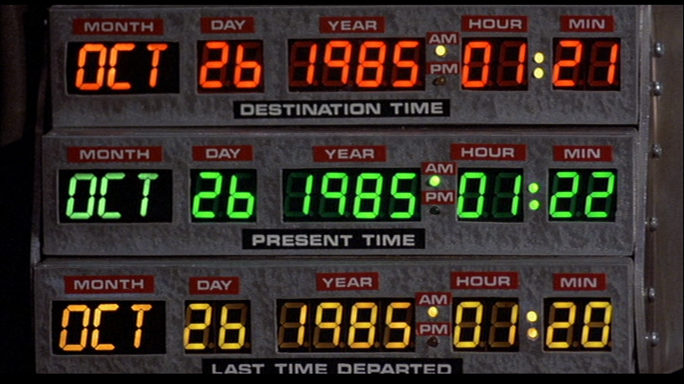

# Got the time?



Every few years I end up having to mess with the time. Not like, the linear flow or the speed at which we perceive
it. As cool as _that_ would be, I'm usually just messing with mundane Windows time settings. When you're working with
physical security systems, maintaining accurate time across all servers and devices is kind of important. And it's
common for surveillance and access control networks to be isolated from the Internet, so not only do you need a time
source, but you need to _distribute_ the time. Fortunately, Windows has a built-in time server - you just have to know
how to turn it on!

<!-- more -->

## Introducing W32Time

On basically any version of Windows released in your lifetime (probably), there exists a Windows service called
"W32Time" or "Windows Time". This service handles synchronization of time from Active Directory sources as well as
Network Time Protocol or "NTP" sources.

Most, if not all, of the settings related to time synchronization is stored in the Windows Registry under `HKEY_LOCAL_MACHINE\SYSTEM\CurrentControlSet\Services\W32Time`
and the main settings are stored as values under the `Parameters` key. You can modify these settings directly, and
restart the W32Time service to force it to load the new settings, but there's a native command-line tool named `w32tm`
that can do most things for you.

## Common w32tm commands

### Get the source


```plaintext title="Query the current source"
w32tm /query /source
```

This will return your configured time source. In my case it returns "pool.ntp.org" and sometimes "time.windows.com" since
I configured my non-domain-joined Windows 11 computer with two NTP server addresses. This command only ever returns one
of them - presumably the last-used server address.

You can pull this setting from the registry using the `Get-ItemPropertyValue` command below. Note that your registry
value may be appended with ",0x9" or ",0x8" and right now I'm just not curious enough to find out what that means.

```powershell title="Retrieve the current source(s) from the registry"
(Get-ItemPropertyValue -Path HKLM:\SYSTEM\CurrentControlSet\Services\W32Time\Parameters -Name NtpServer) -split ' '
```

### Update the source


```plaintext title="Set the time source(s) and enable automatic updates"
w32tm /config /update /syncfromflags:MANUAL /manualpeerlist:"pool.ntp.org time.windows.com"
```

This will modify the configured time sources, and update the W32Time service to let it know the configuration changed.
The `/manualpeerlist` argument accepts a space-delimited list of addresses, so if you supply more than one address you
need to surround them in quotes. The opening quote can be placed before `/manualpeerlist`, or it can be placed after
`/manualpeerlist:` as in the example above.

The argument `/syncfromflags:MANUAL` is the one that will turn the "Set time automatically" setting "On" in the Windows
Date & time settings. Or, as you'll find in the legacy "Internet Time Settings" dialog, it checks the "Synchronize with
an Internet time server" box.


## Make it a time server

The `W32Time` service be configured to keep your computer in sync with an NTP server, _and_ it can provide NTP service to
other computers on the network. This is really helpful when you have a lot of non-domain-joined computers and/or other
networked devices on the network like IP cameras, access control readers, and anything else that can be configured with
an NTP server address for time synchronization.

Unfortunately it doesn't look like the `w32tm.exe` tool allows you to turn on the `NtpServer` feature, but you can do
this with a couple of registry changes and a restart of the `W32Time` service to apply the changes. Don't forget to open
UDP port 123 in your firewall to allow incoming connections.

```powershell title="Enable NtpServer feature" linenums="1"
# Note: The AnnounceFlags value of 5 is a bitwise OR of 1 (Timeserv_Announce_Yes) and 5 (Reliable_Timeserv_Announce_Yes)
Set-ItemProperty -Path HKLM:\SYSTEM\CurrentControlSet\Services\W32Time\TimeProviders\NtpServer -Name Enabled -Value 1
Set-ItemProperty -Path HKLM:\SYSTEM\CurrentControlSet\Services\W32Time\Config -Name AnnounceFlags -Value 5
Restart-Service -Name W32Time

# You need to allow UDP port 123 through the firewall for clients to successfully update time from this machine
New-NetFirewallRule -DisplayName "Allow Inbound NTP Requests" -Direction Inbound -LocalPort 123 -Protocol UDP -Action Allow
```

--8<-- "abbreviations.md"
