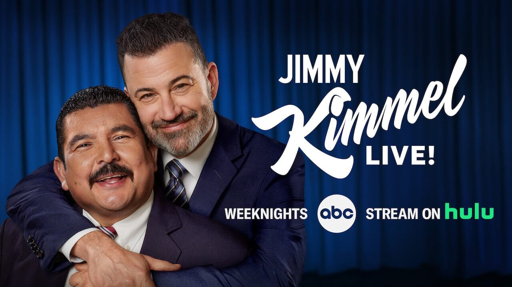

---
date:
  created: 2025-09-18
authors:
  - joshooaj@gmail.com
categories:
  - Politics

links:
  - Nexstar Media Group (Wiki): https://en.wikipedia.org/wiki/Nexstar_Media_Group
  - Nexstar Statement: https://www.nexstar.tv/nexstar-abc-affiliates-to-preempt-jimmy-kimmel-live-indefinitely-beginning-tonight/
  - Tegna: https://en.wikipedia.org/wiki/Tegna_Inc.
  - Paramount Skydance Merger: https://en.wikipedia.org/wiki/Merger_of_Skydance_Media_and_Paramount_Global
---

# The Collapse of Freedom of Speech in Real-Time

Say what you will about Charlie Kirk *(at your own risk)*, but prior to his heinous murder the man
enjoyed his 1st amendment rights to freedom of speech and believed in the free exchange of ideas.
He encouraged and promoted public debates with prominent voices on the left. Now, the political
right are callously using his gruesome assassination to silence MAGA critics.

<!-- more -->

## The Premise

Yesterday, September 17th, Nexstar Media decided to use one of Charlie Kirk's favorite debate tools, the
[straw man argument](https://en.wikipedia.org/wiki/Straw_man), to justify pulling Jimmy Kimmel Live!
off the air. In [their statement](https://www.nexstar.tv/nexstar-abc-affiliates-to-preempt-jimmy-kimmel-live-indefinitely-beginning-tonight/),
they say...

!!! quote "Andrew Alford, Nexstar Media Group"

    Mr. Kimmel’s comments about the death of Mr. Kirk are offensive and insensitive at a critical time in our national political discourse, and we do not believe they reflect the spectrum of opinions, views, or values of the local communities in which we are located

But when you examine Jimmy Kimmel's *own words*, it's clear this is an extreme overreaction if not a
complete lie...

!!! quote "Jimmy Kimmel"

    We hit some new lows over the weekend with the MAGA gang desperately trying to characterize this kid who murdered Charlie Kirk as anything other than one of them and doing everything they can to score political points from it,

There was nothing insensitive said about Charlie Kirk in the monolog. It is *fact* that before any
evidence was available at all, the political right were on the air making statements about how the
killer was a "radical leftist", or transgender, and that "they" were at war with "us". And the
president's own behavior and rhetoric clearly demonstrate that he is only interested in using this
tragedy as a weapon against his detractors.

## The Merger

It's no secret that our current president has the thinnest skin, and has been vocal about his
feelings toward all of the late night comedy hosts including Stephen Colbert, Jimmy Kimmel,
JimmyFallon, Seth Meyers and more.

Back in July, The Late Show with Stephen Colbert was cancelled, making the current season the last
season of the show. The reason this was controversial is that [a merger between Paramount and Skydance](https://en.wikipedia.org/wiki/Merger_of_Skydance_Media_and_Paramount_Global)
required FCC approval, and it's largely believed that the cancellation of The Late Show was
intended to curry favor with this administration.

And wouldn't you know it — Nexstar Media Group, the largest television station owner in the United
States, is [working on a merger with Tegna](https://www.tegna.com/nexstar-media-group-inc-enters-into-definitive-agreement-to-acquire-tegna-inc-for-6-2-billion-in-accretive-transaction/), and once again this
requires FCC approval.

It is suspiciously convenient that Nexstar would use Jimmy Kimmel's latest monolog as an excuse to
have him cancelled. They clearly saw that it worked with Stephen Colbert, and this is so obviously
their way of bending the knee to our corrupt administration in return for approving their merger.

## Be Heard

Late last night I was looking for a way to express my concerns to ABC, Disney, Nexstar, etc. ABC
actually had a list of executive contact names and email addresses published at [https://www.detpress.com/abc/contacts/](https://www.detpress.com/abc/contacts/),
so I sent them an email expressing my support for Jimmy Kimmel and freedom of speech, and my concern
that this move was pay-to-play corruption. As of this morning the contact page has been removed, but
I anticipated they might do that and saved the information. Plus, the [wayback machine always remembers](https://web.archive.org/web/20250917042702/https://www.detpress.com/abc/contacts/).

I don't know what good it will do, but maybe if we all show our support for Jimmy Kimmel and our
1st amendment rights, we can get his show reinstated and prevent further erosion of our democracy.

Scanning the following QR code with your phone should open a new email with the subject and 24
addresses filled in for you.

### Sample Message

While I think you should write your own messages, here's some inspiration. Make your voices heard,
be critical, and never threaten anyone with violence.

!!! quote "Sample message"

    Hello all,

    I'm deeply concerned about Disney, ABC, and Nexstar's capitulation to federal government pressure to silence those who are critical of the current administration. This chills free speech and invites future political coercion. I think you know that the content of Jimmy Kimmel's monolog is not the real reason for the decision to pull the show.

    The FCC is obviously strongarming media companies to fall in line with the current administration's agenda, and by caving to this pressure, you are buying political points with the president and the FCC to improve the chances of a successful merger between Nexstar and Tegna. This smells just like the Paramount / Skydance merger where The Late Show with Stephen Colbert was cancelled to appease the administration.

    I hate to say it, but free speech and democracy are under attack in the United States, and you are on the front line. I understand you serve a business in a capitalist world, but I presume most of you are also American citizens and residents who enjoy 1st Amendment rights. These rights, and so much more are at stake. We need our media companies to stand strong against political interference and corruption.

    Please reinstate the Jimmy Kimmel Live! show, and hold the line for free speech. We'll have your back.

### Contact List

| Contact                                                                      | Email                          |
|------------------------------------------------------------------------------|--------------------------------|
| Alexis Santiago                                                              | Alexis.Santiago@disney.com     |
| Ashley Kline Shapiro, Vice President, ABC Entertainment Publicity            | ashley.r.kline@disney.com      |
| Brett Levine                                                                 | brett.levine@disney.com        |
| Chelsie Tanamachi, Director, Unscripted Publicity                            | chelsie.m.tanamachi@abc.com    |
| Cheryl Pratesa, Affiliates Lead                                              | cheryl.pratesa@abc.com         |
| Derek Del Rossi, Senior Vice President, Publicity                            | Derek.Del.Rossi@disney.com     |
| Jeannie Kedas, Senior Vice President, Publicity and Corporate Communications | Jeannie.Kedas@abc.com          |
| Katherine Nelson, Senior Vice President, Publicity                           | katherine.nelson@disney.com    |
| Kellyn Holmes                                                                | kelyn.holmes@disney.com        |
| Kristen Osborne, Primetime & Daytime                                         | Kristen.Osborne@abc.com        |
| Kylie Nishite                                                                | kylie.nishite@disney.com       |
| Lauren Milovich                                                              | lauren.milovich@abc.com        |
| Lauri Hogan, Publicity Director ABC News Studios                             | lauri.l.hogan@abc.com          |
| Leslie Schwartz                                                              | leslie.schwartz@disney.com     |
| Marianne Price                                                               | Marianne.Price.-ND@disney.com  |
| Michaela Zukowski                                                            | michaela.zukowski@abc.com      |
| Nicole Gonzales                                                              | Nicole.J.Gonzales@abc.com      |
| Philip Galicia                                                               | Philip.Galicia@disney.com      |
| Pons Rongavilla, Ratings/Viewership, Corporate                               | ponciano.rongavilla@disney.com |
| Rachel Villegas                                                              | rachel.villegas@disney.com     |
| Sarah Jautz, Publicist News, ABC News Studios                                | sarah.jautz@abc.com            |
| Sarah Castellvi                                                              | Sarah.Castelvi@disney.com      |
| Sepehr Amirkhalil                                                            | Sepehr.Amirkhalili@disney.com  |
| Gary Weitman, EVP & Chief Communications Officer                             | communications@nexstar.tv      |

## Disclaimer

My opinions are my own and do not reflect those of my employer, or any other person or organization
I am affiliated with. I do not condone violence, including political violence. I also do not condone
doxxing, and all names and email addresses shared in this post were acquired from official, public
sources. To the best of my knowledge all of the email addresses shared are commercial email addresses
associated with Disney, ABC, and Nexstar Media Group.

--8<-- "abbreviations.md"
