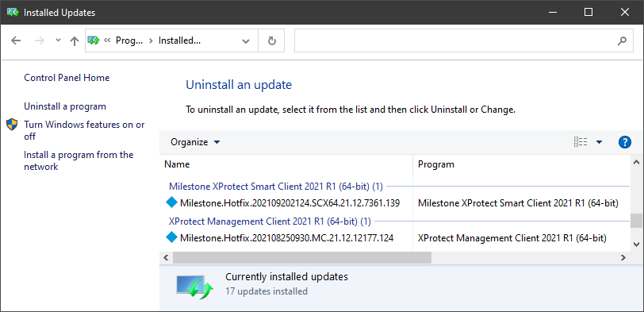
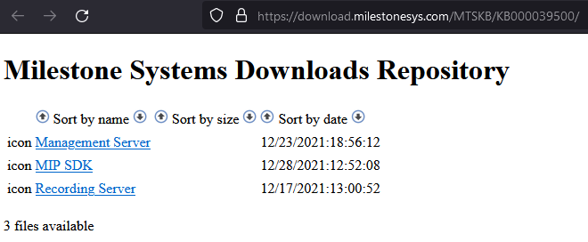

# List Milestone XProtect Cumulative Patches

The release strategy for Milestone's XProtect VMS software is currently to drop three versions every year, with the occasional exception. The most recent release was version 2021 R2, released in October. The next version will be 2022 R1. The "major.minor" version numbers that will be used this year are 22.1, 22.2 and 22.3. But that only accounts for scheduled releases - what about hotfixes?

<!-- more -->

Today, Milestone releases hotfixes on a regular basis - whenever they're needed. Due to the nature of the data recorded and managed by the XProtect VMS software, it's important to stay up to date with patches as they're made available. In this article I'll share _one way_ you can use PowerShell to report which cumulative patches are applied. Equipped with that information, one could setup a process of automating the deployment of approved cumulative patches in their environment.

``` powershell title="Example: Get-VmsHotfix"
PS C:\> Get-VmsHotfix | Select-Object DisplayName, DisplayVersion

DisplayName                                        DisplayVersion 
-----------                                        -------------- 
Milestone.Hotfix.202109202124.SCX64.21.12.7361.139 21.12.7361.139 
Milestone.Hotfix.202108250930.MC.21.12.12177.124   21.12.12177.124
```

But first, let's cover a bit of background and make sure we're on the same page about what hotfixes and patches and cumulatives are.

## What is a "hotfix"?

The term "hotfix" refers to a package of one or more files which usually replace the existing files of the same name. These are often DLL's (Dynamic Link Library), or EXE's (executables). DLL's and executables both contain compiled code. Often a fix for a major software bug can end up changing only one file out of hundreds, or even thousands of files that make up the whole application.

We normally refer to a hotfix as the initial "quick fix" to update a system experiencing a problem of some kind. Once the hotfix is proven, it usually gets rolled into the core product. But it often makes the most sense to send customers "patches" to replace the small number of changed files on their existing installations versus shipping a whole new product installer. Shipping a whole product installer is more work for both the development team and the customer.

For the first several years of my career with Milestone, we delivered hotfixes/patches as zip files containing the patched DLL's and EXE's, along with some instructions. It worked, and I had a love/hate relationship with the simplicity of it. But sometime toward the end of 2016 we started using the Milestone Patch Installer, and it was a _big upgrade_ for our customers. They no longer had to read and follow detailed instructions on where each file needed to be. They didn't have to remember to stop the related Windows Services or applications. And Milestone's technical support team (myself included) no longer had to worry about customers applying the wrong fixes, or putting them in the wrong place on the file system.


## Milestone Patch Installer

The design of the patch installer uses Microsoft's Windows Installer framework to apply "patches". Check out Microsoft's documentation on [Patching and Upgrades](https://docs.microsoft.com/en-us/windows/win32/msi/patching-and-upgrades) if you want to know more about how it works. Effectively it's the same strategy of shipping the updated DLL's, only in a much cleaner and easier to manage format. There are _lots_ of opinions about how to ship software and updates including containerization, Chocolatey, NuGet, and I'm quite fond of the alternatives. That said, for an application installed using the Windows Installer framework, I think it makes a lot of sense to use the patching functionalty baked into that framework. And it made it _significantly_ easier to verify if a patch had been applied or not, and to ensure it was applied _correctly_.

Here's what it looks like when you have one or more Milestone cumulative patches applied. To see this list of updates, go to Control Panel > Programs and Features > Installed Updates.



Milestone's patches are typically referred to as "Cumulative Patches", "Cumulative Hotfixes" or simply "cumulatives". The point is, if you install the cumulative patches for an XProtect VMS 2021 R2 installation, you should expect that _all fixes_ available at the time you downloaded the patch installer are included in that installer. Bug fixes are sometimes rolled out 2-3 times in a month, so if you missed the first two cumulatives, that's okay. Just download the latest cumulatives available for your product version and all prior fixes for your VMS version will be applied.

The way patches are distributed today, you'll find a "Milestone Patch Installer" download for each Milestone component for which a patch is available. For example, [here](https://supportcommunity.milestonesys.com/s/article/XProtect-2021-R2-cumulative-patch-installers?language=en_US) is where you can find the Milestone Patch Installer downloads for 2021 R2 today. You can see there's something available for Management Server and Recording Server, as well as a download available for MIP SDK.



## What about automation?

If you have more than a handful of servers in your Milestone VMS infrastructure, you should be looking for ways to automate as much as possible with regard to the ongoing maintenance and configuration of that environment. First of all, you don't want to be wasting your time using remote access tools to open an interactive remote desktop with _each and every server_ when you want to check which software and patches are installed.

- Silent install and uninstall (/install /quiet)
- List installed patches (registry, powershell)
- Check for latest available patches (hard)
