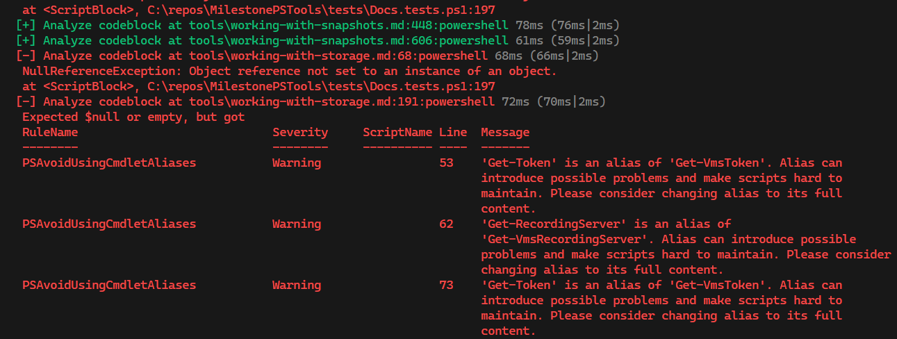
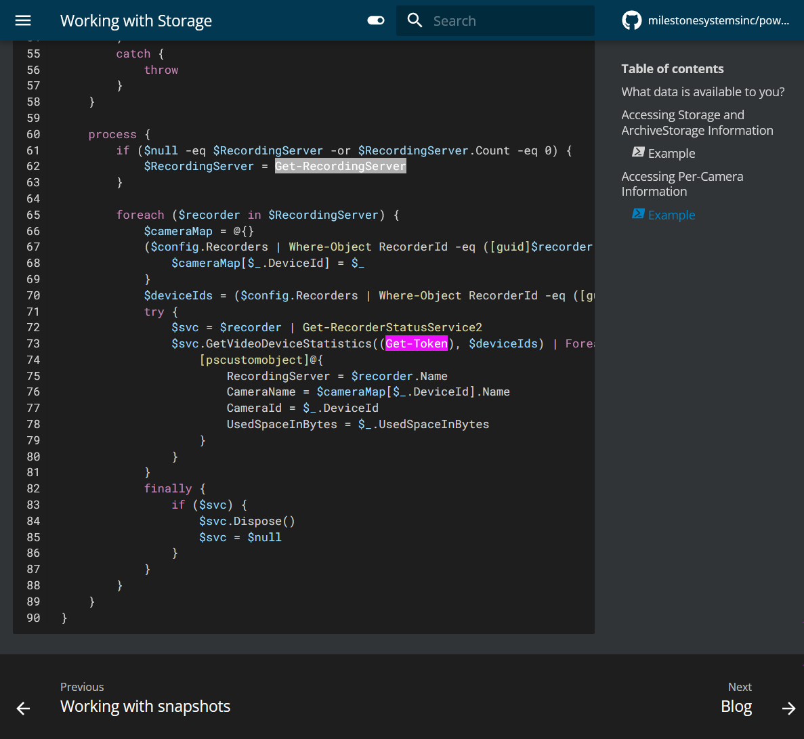
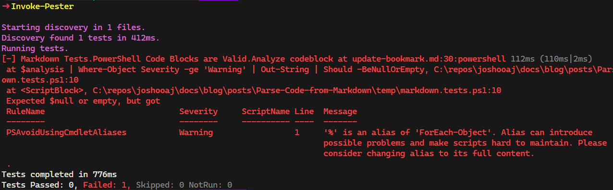

---
date:
  created: 2023-10-12
authors:
 - joshooaj@gmail.com
categories:
  - PowerShell
  - Markdown
---

# Parse Code from Markdown Files



## Introduction

Are you testing your documentation? If you write PowerShell scripts or modules, you are *hopefully* using Pester to
test your code. And if you use PlatyPS to generate markdown documentation like I do, then you have a bunch of example
PowerShell code sitting in .md files. But what happens if you rename a command, a parameter, or make a breaking change?

<!-- more -->

Your documentation is the face of your product. It's the source of truth for the people who use it, whether it's a
PowerShell module or something else entirely unrelated. When your examples have errors in them, it won't be obvious to
everyone. Some people may copy and paste your examples, see an error, and move on. Maybe they see the use of aliases
and other coding patterns that are generally not recommended to use in source code or documentation and pick up those
habits, or they become unsure about the overall quality of the product behind the documentation?

The [MilestonePSTools](https://www.milestonepstools.com) PowerShell module I work on has 413 markdown files under the
docs folder, and 394 of those files were generated by PlatyPS for commands in the module (in English and Spanish). I
have a bunch of tests for the module itself, but until today I was not testing *any* examples or other PowerShell code
blocks found in the documentation.

## Oh aliases...

My PowerShell journey started in 2019 when I began building a module. I was learning PowerShell at the same time I was
building what would become a commercially used module, and learning best practices and common patterns from the
community. One important best practice I failed to learn early on was use a prefix for the nouns in command names to
prevent collisions with commands from other modules. So after I while, I started to add a "Vms" prefix to the commands
in the module, and I started renaming commands and adding an alias to the new command matching the old one to help
prevent breaking changes.

The Pester test screenshot at the top of this post shows that there are some old pre-prefix commands still in use. At
the time the documentation was written, these weren't aliases at all. But they are now, and people reading this
documentation might be confused about the command names, or they may just naturally start using the alias version of
those commands because it's in the documentation so it *must* be right!



## Demonstration

Let's take a look at an excerpt of the docs from another command, this time in markdown format. In the first
example for `Update-Bookmark`, I used the "%" alias in place of `ForEach-Object`. To be fair, I wanted to keep the example
line from being too long. But I know there are better strategies to achieve that.

````markdown hl_lines="31" title="Update-Bookmark.md" linenums="1"
--8<-- "blog/posts/Parse-Code-from-Markdown/update-bookmark.md.txt"
````

The `Get-MdCodeBlock` command uses regular expressions to determine whether a line represents the beginning, or end of
a code fence, and whether inline code is present in that line. If a language shortcode is used, that information is
grabbed and returned with each code block. For the markdown example above, that looks like...

```powershell
Get-MdCodeBlock -Path .\Update-Bookmark.md | Select-Object Source, LineNumber, Position, Inline, Language | Format-Table

# Source                  LineNumber Position Inline Language
# ------                  ---------- -------- ------ --------
# Update-Bookmark.md               9        0  False
# Update-Bookmark.md              15        4   True
# Update-Bookmark.md              30        0  False powershell
```

For brevity I didn't include the `Content` property in the example output above, but you can probably see the value in
checking all of the example code you wrote years ago and never looked at again, despite the code base seeing dramatic
changes and growth over time.

## Sample Pester Test

Here's a basic Pester test which uses `Get-MdCodeBlock` to extract the powershell example and pass the content to `Invoke-ScriptAnalyzer`.

```powershell title="markdown.tests.ps1"
--8<-- "blog/posts/Parse-Code-from-Markdown/markdown.tests.ps1"
```

I absolutely love having this improved visibility into the health of the documentation. The tests call out the file, line
number, and give me the formatted output from PSScriptAnalyzer. And you can get even more creative by using the PowerShell
language parser to extract an abstract syntax tree and inspect all code hiding in markdown files for just about anything.



## Code

[Download :material-download:](Get-MdCodeBlock.ps1){ .md-button .md-button--primary }

```powershell linenums="1"
--8<-- "blog/posts/Parse-Code-from-Markdown/Get-MdCodeBlock.ps1"
```

--8<-- "abbreviations.md"
