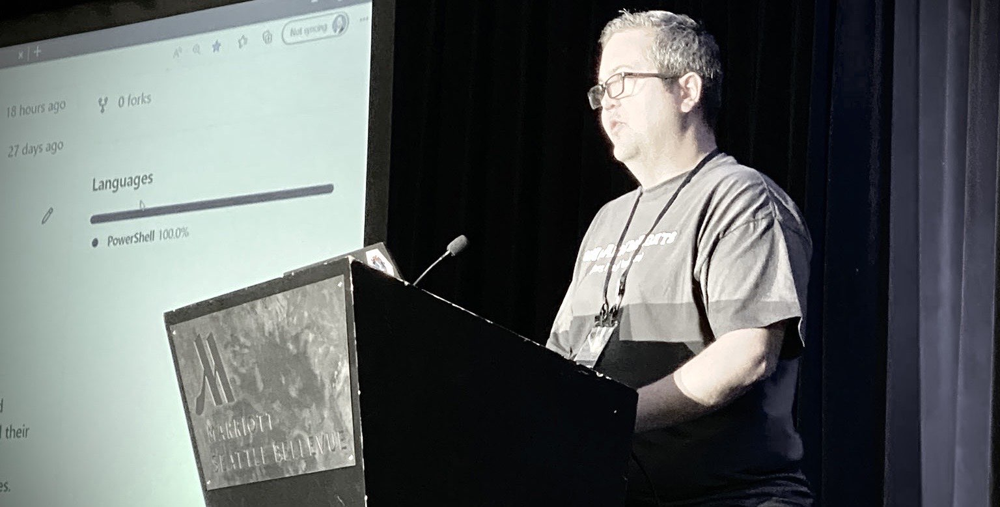

# Welcome

I'm Josh, and this is my technical blog dedicated to topics related mostly
to software development, including:

- PowerShell modules, scripts, and tips
- Automation / DevOps
- .NET / C#
- Milestone XProtect VMS software & integrations
- Home lab shenanigans involving reverse proxies, identity systems, and containers

<!-- more -->

## About me

I'm currently a senior principal engineer at [Milestone Systems](https://www.milestonesys.com/)
where I've enjoyed a variety of roles and experiences since 2006. A few years
ago I transitioned out of a principal role in the technical support team into
a full-time floating role half way between firefighting technical support and
professional services escalations, and software development. As of the start of
2024 I am a full time software developer working with a mix of PowerShell,
.NET, and things that might be considered DevOps but I just call being a well
rounded software engineer.

A sizable chunk of my time goes toward maintaining and supporting the [MilestonePSTools](https://www.milestonepstools.com/)
PowerShell module I started building in 2019, and it's my favorite project to
work on. It enables Milestone XProtect customers to automate configuration,
reporting, export tasks, and more on their video surveillance systems, and it's
used by customers at every scale from small businesses with a handful of cameras
to government agencies and giant global data centers.

I began learning PowerShell in 2019 as a part of the process of building
MilestonePSTools, and I fell it love with it as a shell, as a language, and
especially as a community. I have been attending the [PowerShell + DevOps Global Summit](https://www.powershellsummit.org/)
in Bellevue, WA since 2021, and I can't recommend it highly enough. The insight
shared during (and between) sessions is inspiring, and the community is diverse
and welcoming.

--8<-- "abbreviations.md"
