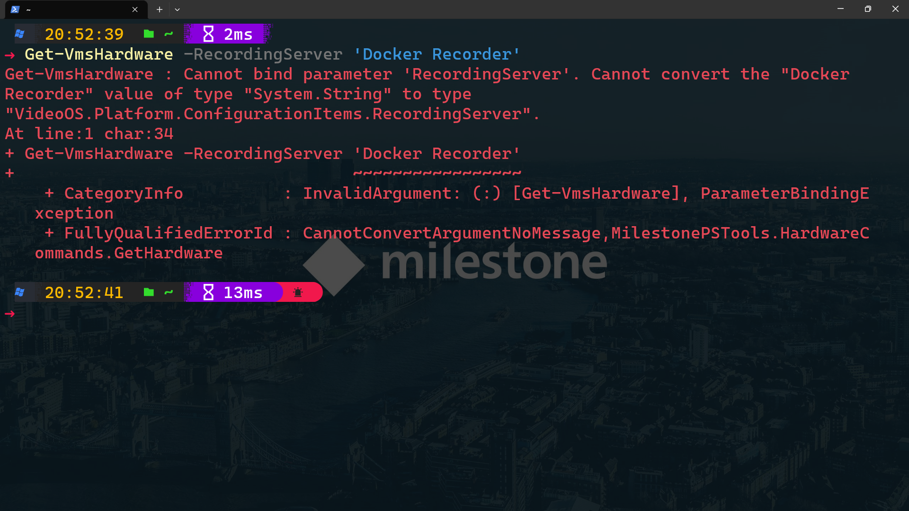
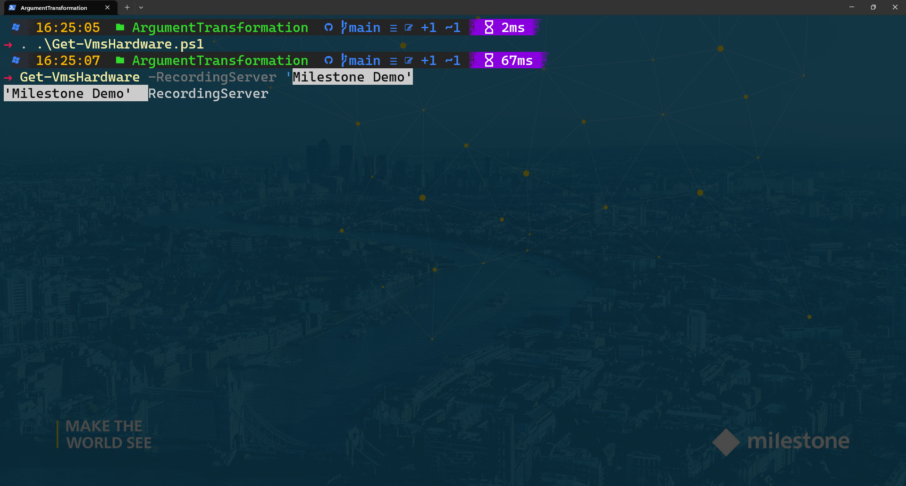

# Argument Transformation Attributes

## Introduction

Argument transformation attributes make it possible to offer your users
some flexibility in how they supply values for parameters. I've started to use
these in the [MilestonePSTools](https://www.milestonepstools.com) module to
make it possible to provide a name instead of a strongly typed object like a
`#!powershell [RecordingServer]` or a `#!powershell [Role]`, while still making it clear in the
`#!powershell Get-Help` documentation what the expected object type is, and without
polluting functions with object transformation code.

<!-- more -->

In my last post I introduced [argument completers](../ArgumentCompleters/ArgumentCompleters.md), and I consider these an absolute necessity for PowerShell functions and modules that
will be shared and used by many people. Argument _transformation attributes_ on
the other hand are an advanced feature that can look intimidating to those early
in their PowerShell journey. They are, in my opinion, [syntactic sugar](https://en.wikipedia.org/wiki/Syntactic_sugar) and thus purely optional.

## Example use case

It has been almost 4 years since the first release of he MilestonePSTools
module. In that time, one common question has been about `ParameterBindingException`
errors. For example, if you wanted to get all hardware (cameras) from a
recording server, you might try `#!powershell Get-VmsHardware -RecordingServer 'Docker Recorder'`
which seems perfectly reasonable. But you'd be met with the following error...

```text
Cannot bind parameter 'RecordingServer'. Cannot convert the "Docker Recorder" value of type "System.String" to type "VideoOS.Platform.ConfigurationItems.RecordingServer".
```



The `Get-VmsHardware` function expects a recording server _object_ instead of
a recording server name. The correct usage would then look like...

```powershell
$recorder = Get-VmsRecordingServer -Name 'Docker Recorder'

# Pipe the recording server in to Get-VmsHardware
$recorder | Get-VmsHardware

# Or provide it as a named parameter
Get-VmsHardware -RecordingServer $recorder
```

By introducing an argument transformation attribute, we can make the
`#!powershell Get-VmsHardware` function accept _either_ a recording server
object, _or_ a recording server name, without changing the parameter type or
any of the code within the `begin`, `process`, or `end` blocks.

## Writing an argument transformation attribute

An argument transformation attribute must be written as a [class](https://learn.microsoft.com/en-us/powershell/module/microsoft.powershell.core/about/about_classes?view=powershell-7.3)
and inherit from the [`System.Management.Automation.ArgumentTransformationAttribute`](https://learn.microsoft.com/en-us/dotnet/api/system.management.automation.argumenttransformationattribute?view=powershellsdk-7.3.0) class. Your class must then override the `Transform(EngineIntrinsics, Object)` abstract method which is where the code that performs the object
transformation will go.

Below you will find my `RecorderNameTransformAttribute` implementation. I _only_
want it to transform strings into recording server objects. If the value
provided by the user is `#!powershell $null` or is not a string, then the object
will be returned as-is. I could do additional checking during the argument
transformation, but PowerShell's own parameter binding and handling of null or
invalid types is already so good. Why reinvent the wheel?

```powershell linenums="1"
--8<-- "posts/ArgumentTransformation/Get-VmsHardware.ps1::35"
```

## Using the argument transform in Get-VmsHardware

Once the argument transformation attribute class has been defined, it can be
used in any cmdlet or function in your script or module by adding `#!powershell [RecorderNameTransformAttribute()]` (or whatever you decide to call your custom
attribute) between `#!powershell [Parameter()]` and the parameter name. In the
definition of `#!powershell Get-VmsHardware` below, the highlighted line was
the only change required for the function to accept recording servers by name.

```powershell linenums="1" hl_lines="5"
--8<-- "posts/ArgumentTransformation/Get-VmsHardware.ps1:36:76"
```

1. This attribute is the _only_ change required to the `#!powershell Get-VmsHardware`
   function to enable it to accept recording server names in addition to
   `#!powershell [RecordingServer]` objects.
2. By adding this attribute we can be sure that all elements in `#!powershell $RecordingServer`
   have a value and are not `#!powershell $null` inside the `#!powershell process {}` block.

## Adding an argument completer

While I hold the opinion that argument transformation attributes are nearly
always "extra" and not required, now that it's been implemented for `#!powershell Get-VmsHardware`
we should probably make it easy to take advantage of using an argument completer.

By adding the argument completer below to the class and function definitions
below, the user will be able to tab or list-complete values for the
`-RecordingServer` parameter, making it not only _possible_ to provide a name
instead of an object, but _easy_!

```powershell linenums="1"
--8<-- "posts/ArgumentTransformation/Get-VmsHardware.ps1:77:"
```



## The final result

We can now put the three code blocks above together and use it! It's important
to note though that when you're working with PowerShell classes like the
`RecorderNameTransformAttribute` class in this example, we can't _reference_
the class before _defining_ the class.

What I mean by this is that we can't add the `#!powershell [RecorderNameTransformAttribute()]`
attribute to a function parameter if the class definition appears somewhere
after, or below the `Get-VmsHardware` function definition. So if you copy &
paste the script below as-is, it will work just fine. But if you move the class
definition down under the function, PowerShell will complain that it doesn't
recognize the `RecorderNameTransformAttribute` class when it attempts to process
the `#!powershell [RecorderNameTransformAttribute()]` attribute.

When you use classes in a module, it's important to [dot source](https://learn.microsoft.com/en-us/powershell/module/microsoft.powershell.core/about/about_operators?view=powershell-7.3#dot-sourcing-operator-) the file(s) where your class(es) are defined before
you dot source your functions. And if you have everything in a single .PSM1
file, put your classes at the top of the file so that they are always available
when used in your functions.

The argument completer on the other hand can be defined _anywhere_, _any time_,
because PowerShell doesn't attempt to invoke the argument completer script block
until you have typed the associated command and parameter.

```powershell linenums="1"
--8<-- "posts/ArgumentTransformation/Get-VmsHardware.ps1"
```

1. This attribute is the _only_ change required to the `#!powershell Get-VmsHardware`
   function to enable it to accept recording server names in addition to
   `#!powershell [RecordingServer]` objects.
2. By adding this attribute we can be sure that all elements in `#!powershell $RecordingServer`
   have a value and are not `#!powershell $null` inside the `#!powershell process {}` block.

--8<-- "abbreviations.md"
